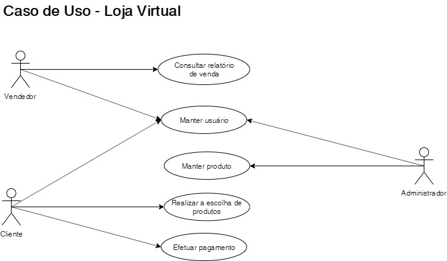

# Trabalho Final - Etapa 1
Nesta etapa os alunos devem entregar os seguintes artefatos:

* Diagrama de use-cases (ao menos 3 atores e 5 casos de uso) 
* Regras de negócios
* Requisitos funcionais
* Requisitos não funcionais
* Descritivo dos casos de uso
* Protótipo de tela de baixa fidelidade (ao menos 5 telas)

